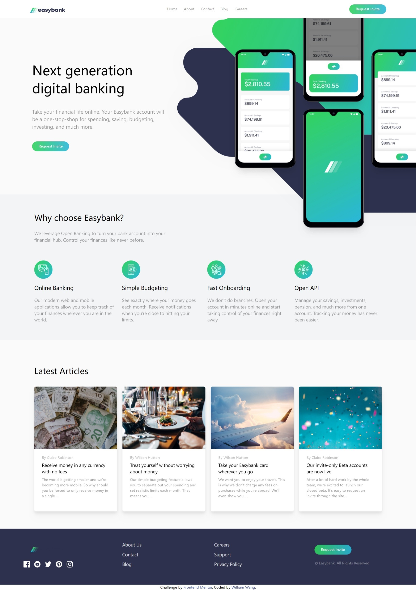
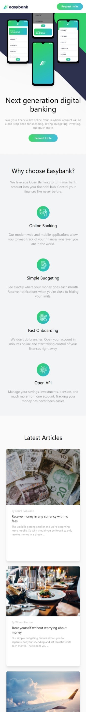
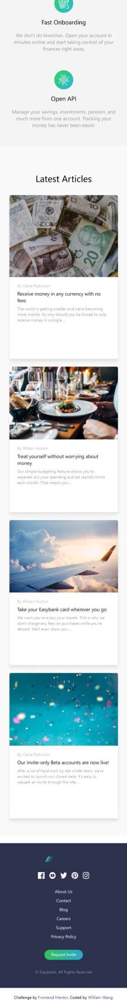
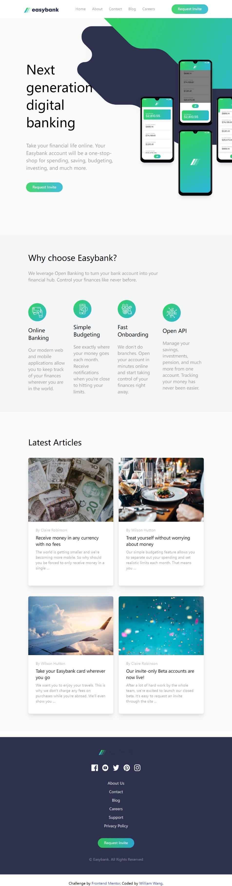

# Frontend Mentor - News homepage solution

This is a solution to the [Easybank landing page challenge on Frontend Mentor](https://www.frontendmentor.io/challenges/easybank-landing-page-WaUhkoDN). Frontend Mentor challenges help you improve your coding skills by building realistic projects.

### The challenge

Users should be able to:

- View the optimal layout for the interface depending on their device's screen size
- See hover and focus states for all interactive elements on the page

### Screenshot

1. Desktop

2. Mobile
   
   
   
   
   
   3. Tablet
      
      

### Links

- Solution URL: [Solution URL](./index.html)

### Built with

- Tailwindcss
- HTML
- CSS
- Javascript

### Continued development

I will continue my frontend development journey and start to learn some libraries and frameworks. 

## Author

William Wang
